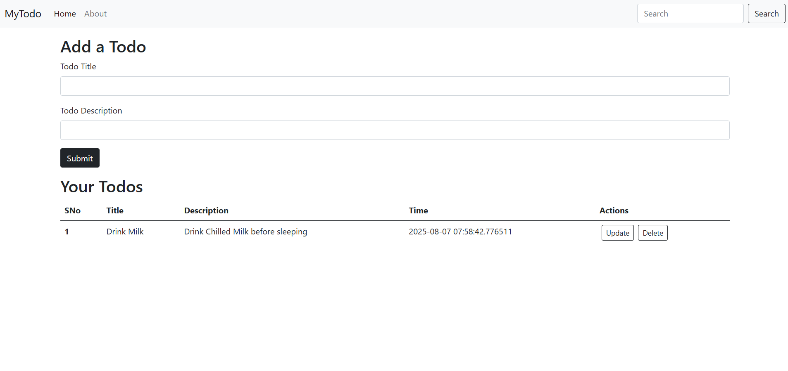
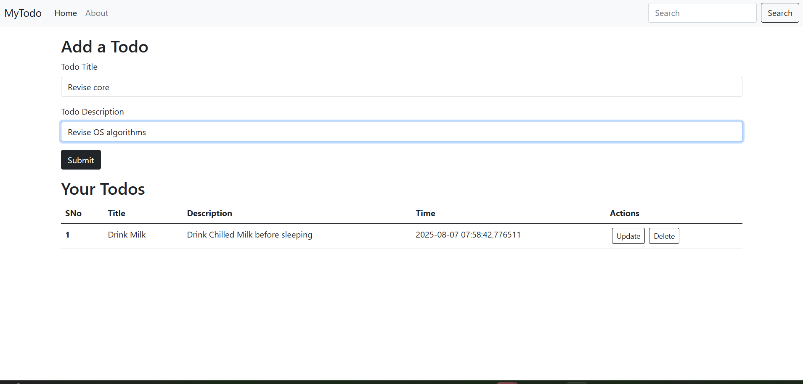
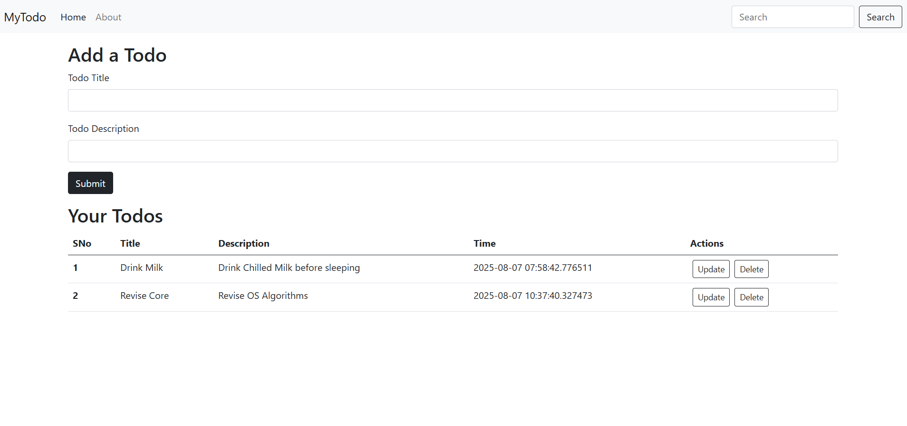
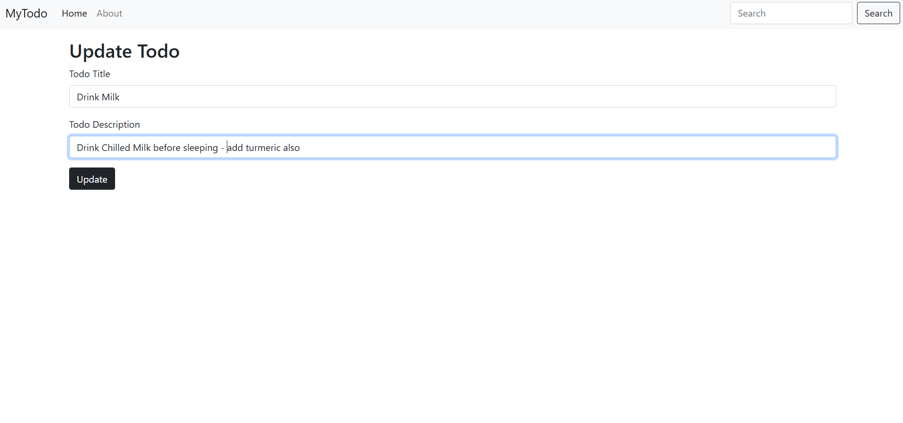
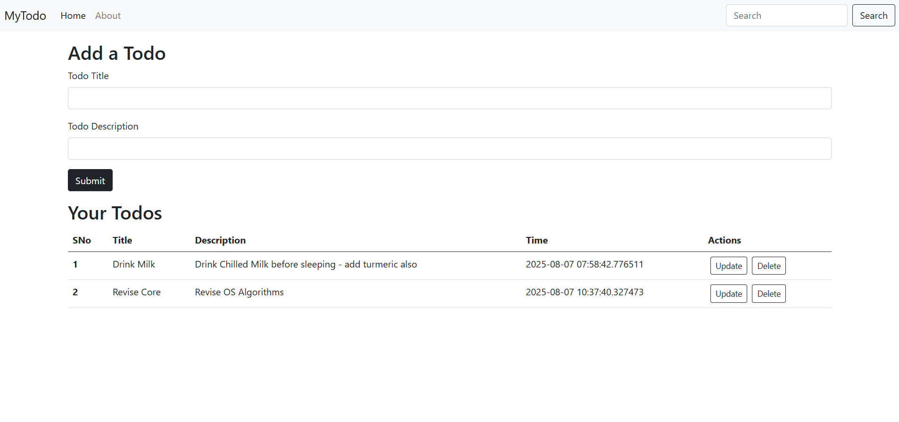

# Flask Todo App

### A beginner-friendly CRUD-based task manager built using Flask, SQLite, SQLAlchemy, and Bootstrap.

---

## Project Description

A simple yet functional To-Do web application where users can add, update, and delete their daily tasks. Built while learning Flask and SQLAlchemy, this app focuses on delivering clean functionality with a responsive Bootstrap UI and persistent storage via SQLite.

---

## Overview

This project demonstrates core concepts of web development with Flask, ORM with SQLAlchemy, and styling using Bootstrap. It helps beginners understand backend logic, templating, and how to manage databases in a lightweight Flask environment.

---

## Key Features

### Homepage

* Displays all current tasks with options to update or delete them.
* Clean Bootstrap-based layout with task status indicators.

### Add Task

* Simple form to create a new task.
* Validations included to ensure non-empty input.

### Update Task

* Inline edit form to update task description.

### Delete Task

* One-click delete option to remove completed or unnecessary tasks.

---

## Design Principles

### Clean UI

* Bootstrap for layout, responsiveness, and minimal styling.
* Easy to navigate and user-friendly design.

### Responsive Design

* Works across desktops, tablets, and mobile devices.

### Lightweight & Fast

* No heavy frameworks – just Flask, Bootstrap, and SQLite.

---

## Technology Stack

* **Frontend**: HTML5, CSS3, Bootstrap, JavaScript
* **Backend**: Flask (Python)
* **Database**: SQLite using SQLAlchemy ORM

---

## Packages Used

* `Flask` – Python web framework
* `SQLAlchemy` – ORM for database operations
* `Werkzeug` – Utilities for request/response handling (comes with Flask)
* `gunicorn` – For deployment (via Procfile)
* `python-dotenv` – To manage environment variables (optional)

---

## How to Run Locally

### Clone the repository:

```bash
git clone <repository-link>
cd Flask
```

### Create a virtual environment (recommended):

```bash
python3 -m venv venv
source venv/bin/activate  # On Windows: venv\Scripts\activate
```

### Install dependencies:

```bash
pip install -r requirements.txt
```

### Run the application:

```bash
python app.py
```

Then go to `http://127.0.0.1:8000/` in your browser.

---

## 🖼 Screenshots

* Home Page with Task List



* Add Task Form





* Update Buttons in Action





---

## 🧑‍💻 Team Members
* **Ayesha** 

---

## ❤️ Made With Love

©2025 Flask Todo App. All rights reserved.

